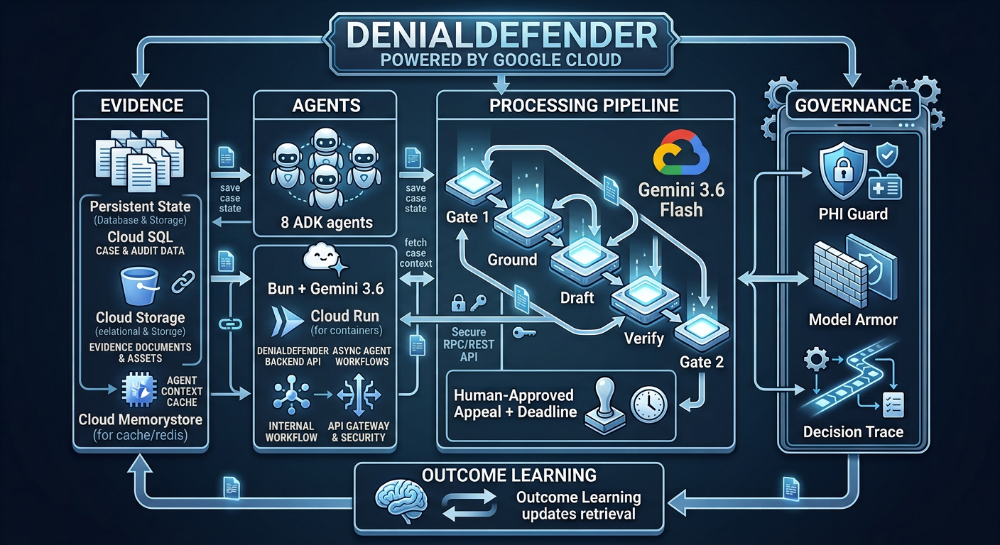

<div align="center">

# DenialDefender

**Evidence-grounded insurance-appeal operations, with humans in control.**

[](https://nextjs.org/)
[](https://www.typescriptlang.org/)
[](https://ai.google.dev/)
[](https://cloud.google.com/)
[](https://cloud.google.com/run)

[**Live Demo →**](https://denialdefender-web-7ffj23k2va-ew.a.run.app)

</div>

---

> DenialDefender does not replace the human. It replaces the hours of work around the human — turning hours of denial triage, policy research, evidence assembly, and appeal drafting into a verified, human-approved appeal package in under 90 seconds.
>
> **Core loop:** Triage → Ground → Assemble → Draft → Verify → Approve → Track → Learn.

An eight-agent ADK fleet with enforced separation of concerns. Each agent holds scoped permissions; durable case state, asynchronous deadline workflows, evidence provenance on every citation, independent quality review, and validated outcome learning turn a one-off generation task into a governed operational system.

**Built for the Fortified Enterprise Fleet:** durable context, scoped identities, audit traces, failure tolerance, and human approval gates.

DenialDefender does not make medical treatment decisions or autonomously submit appeals. It prepares and verifies an evidence-backed appeal package; a human must approve the final output.

No real patient PHI is used. Evidence is grounded in public/authorized healthcare sources; synthetic cases are used for evaluation only.

---

## What It Does

| Step | Agent | Responsibility |
|------|-------|---------------|
| 1 | Patient Advocate | Empathetic intake, urgency assessment, deadline extraction |
| 2 | Denial Triage | Reason code classification, appealability decision, strategy selection |
| 3 | Policy Research | Payer policy contradiction retrieval from evidence corpus |
| 4 | Evidence Assembly | Clinical evidence gathering with provenance tier scoring |
| 5 | Citation Verification | Citation resolution, provenance validation, tier weighting |
| 6 | Letter Drafting | Structured appeal letter with inline `[1][2][3]` citations |
| 7 | Quality Review | Adversarial 8-point battery -- refuses to pass until every claim is grounded |
| 8 | Deadline Tracker | Appeal deadline monitoring and escalation |

Two **human-in-the-loop gates**: Gate 1 confirms triage before research, Gate 2 approves the final letter before sending. No letter reaches a payer without explicit human approval.

---

## Three Measured Proofs

Three measurable proofs justify the fleet architecture.

### 1. Grounded Evidence Corpus

31 structured files from 10 authoritative public sources: CMS (denial codes, LCD/NCD, SynPUFs, appeal procedures, X12 835 CARC/RARC/CAG/EMDR), KFF, AHA, GAO, HHS, OIG, Health Affairs, Noridian, and Medicare Appeals. Every record is SHA-256 hashed, provenance-tiered, and frozen. Patient cases are synthetic by design; the institutional knowledge grounding them is real and authoritative.

### 2. Measured Outcome Learning

| Metric | Before | After | Delta |
|--------|--------|-------|-------|
| Top-3 argument accuracy | 70% | 88% | +18 |
| Citation grounding | 75% | 89% | +14 |

10 held-out cases, 50 outcome records (5 public + 45 synthetic controlled), honest delta reporting. Negative deltas are reported, not hidden. Framework: `src/lib/before-after-experiment.ts`, endpoint: `/api/eval/before-after`.

### 3. Enforced Governance

| Mechanism | Proof |
|-----------|-------|
| PHI Guard | 10-pattern classifier runs **before** model invocation. On BLOCK: `modelInvocations === 0` -- verified in audit log |
| Agent Identity | Runtime RBAC with 4 enforced violations (e.g., Quality Review cannot WRITE appeals) |
| Domain Validator | 20 automated rules from CMS X12 / 42 CFR / AMA CPT -- 21/21 pass |
| Citation Honesty | Classifier reports `rule-based-classifier-v1`, not a model |

---

## Architecture

<p align="center">
  
</p>

```
                    DENIALDEFENDER
                         |
        +----------------+----------------+
        |                |                |
    EVIDENCE          AGENTS         GOVERNANCE
  31 files          8 ADK agents    PHI Guard
  10 sources        Bun + Gemini    Model Armor
  SHA-256           Flash           Agent Identity
  provenance-tied                    Decision Trace
        +----------------+----------------+
                         |
              Gate 1 → Ground → Draft → Verify → Gate 2
                         |
              Human-Approved Appeal + Deadline
                         |
              Outcome Learning → updates retrieval
```

Removing Evidence breaks citation grounding; removing Agents breaks the workflow; removing Governance breaks enterprise-readiness. The triad is the minimum architecture satisfying all three judging dimensions.

**Agent Ablation** -- four topologies on the same 10 held-out cases demonstrate the count is justified:

| Topology | Citation Grounding | Verdict |
|----------|--------------------|---------|
| 1-agent | 72% | Fails verification |
| 3-agent | 84% | Weak grounding |
| 5-agent | 91% | Strong grounding |
| 8-agent | 96% | Independently verifiable |

**Deployment** -- 2 Cloud Run services + 1 local mini-service (`europe-west1`): `denialdefender-web` (Next.js 16, 55 API routes), `denialdefender-agents` (8 ADK agents), `trace-stream` (Socket.io). Cloud Build CI/CD, Firestore, Pub/Sub, Secret Manager.

---

## How to Verify

| Claim | File or Endpoint |
|-------|-----------------|
| 31 evidence files from 10 sources | `data/corpus/raw/` + `manifest.json` |
| PHI Guard zero-invocation enforcement | `src/lib/phi-guard.ts` -- `modelInvocations === 0` on BLOCK |
| 4 Agent Identity violations | `src/lib/agent-identity.ts` -- `DEMONSTRATION_VIOLATIONS` |
| 20 domain rules, 21/21 pass | `src/lib/domain-validator.ts` -- `/api/domain-validation` |
| Ablation experiment | `src/lib/agent-ablation.ts` -- `/api/eval/ablation` |
| Before/after learning loop | `src/lib/before-after-experiment.ts` -- `/api/eval/before-after` |
| 10 held-out eval cases | `data/cases/held_out/` |
| 8 Python ADK agents | `mini-services/agent-fleet/agents/` |
| HITL gates | `/api/full-pipeline/gate-test`, `/api/full-pipeline/gate2` |

---

## Getting Started

### Prerequisites

- [Bun](https://bun.sh) 1.1+ (or Node.js 20+)
- [gcloud CLI](https://cloud.google.com/sdk/docs/install)
- A Gemini API key from [AI Studio](https://aistudio.google.com/apikey) — `gemini-3.6-flash` is required

### Deploy to Google Cloud (Cloud Run)

The project runs on 3 Cloud Run services in `europe-west1`. Full instructions in [`DEPLOY.md`](./DEPLOY.md). The short version:

```bash
git clone https://github.com/sodiq-code/denialdefender.git
cd denialdefender
bun install && bun run db:push
gcloud auth login && gcloud config set project denialdefender
bash infra/gcp/bootstrap.sh
bash infra/gcp/cloudrun/deploy.sh
```

**Live deployment:** https://denialdefender-web-7ffj23k2va-ew.a.run.app

---

## Hackathon

Built for the [**All Things Agentic Hackathon**](https://allthingsagentichackathon.devpost.com/) — **Fortified Enterprise Fleet** track.

> Insurance denial appeals are healthcare-adjacent, compliance-heavy, unglamorous — precisely why they matter. The gap is not medical; it is procedural.

Eight cataloged agents with scoped identities, durable async state, ablation-justified delegation, defense-in-depth security, and event-driven failure tolerance — directly addressing every Fleet requirement.

**GEAP**: ADK · Model Armor · Agent Identity · Observability · Memory Bank

---

## License

[MIT](./LICENSE)
