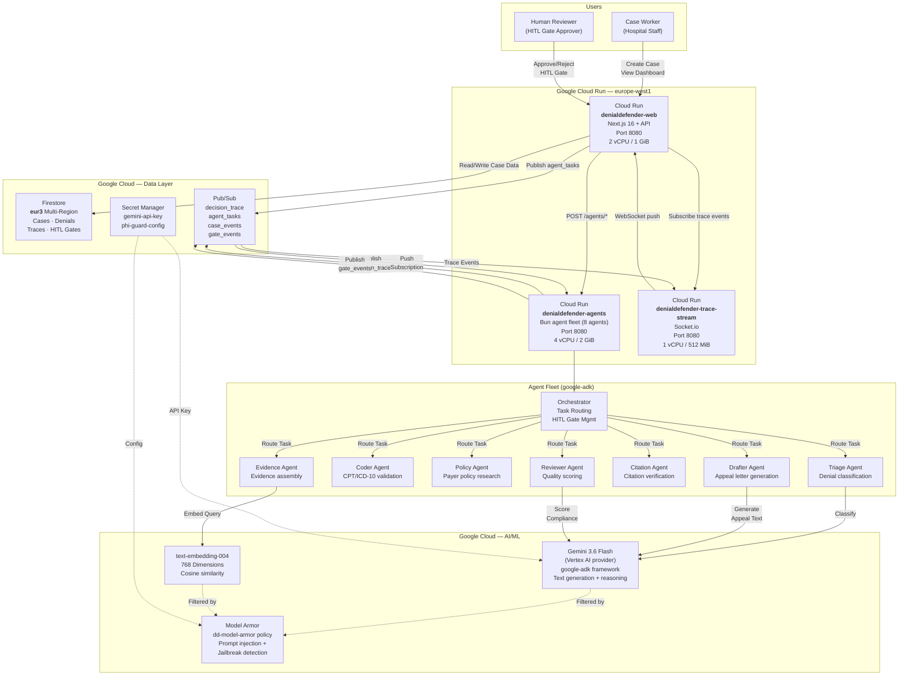
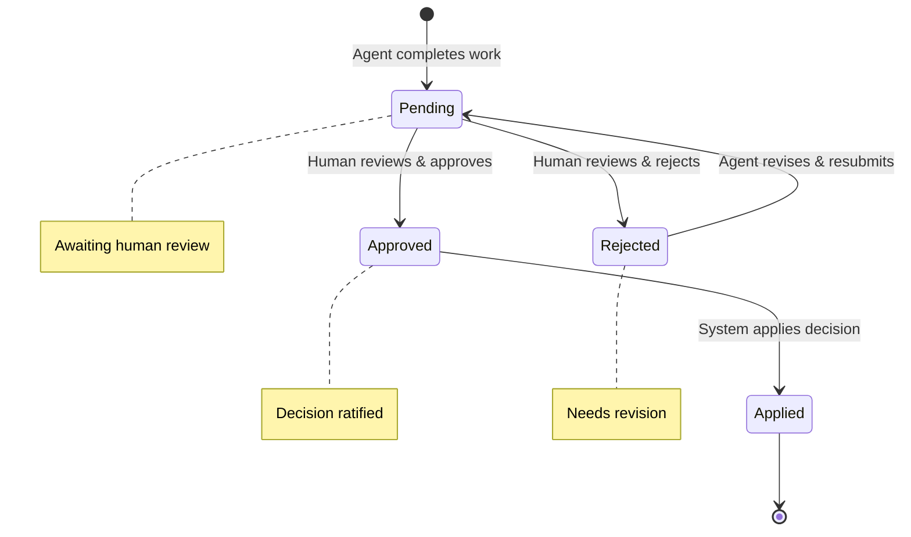
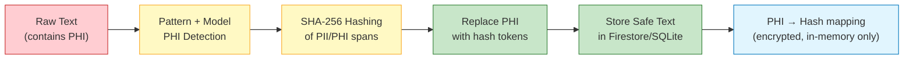
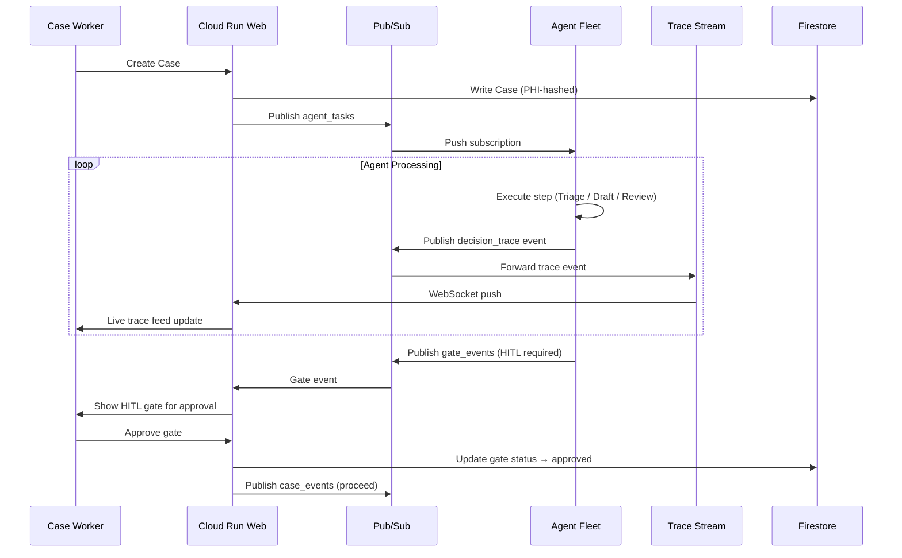

# DenialDefender — GCP Architecture Diagram

> **All Things Agentic Hackathon** — Proof of Production-Readiness
> This diagram shows the full GCP deployment architecture for DenialDefender,
> a multi-agent appeals automation system with HITL governance and PHI protection.

## System Architecture



## Component Details

### Cloud Run Services

| Service | Image | Access | CPU / Memory | Concurrency | Scale |
|---------|-------|--------|--------------|-------------|-------|
| `denialdefender-web` | `europe-west1-docker.pkg.dev/.../denialdefender-web:latest` | Public (unauthenticated) | 2 vCPU / 1 GiB | 80 | 0–4 |
| `denialdefender-agents` | `europe-west1-docker.pkg.dev/.../denialdefender-agents:latest` | Internal only | 4 vCPU / 2 GiB | 10 | 0–10 |
| `denialdefender-trace-stream` | `europe-west1-docker.pkg.dev/.../trace-stream:latest` | Public (unauthenticated) | 1 vCPU / 512 MiB | 80 | 0–2 |

### Agent Fleet (Google ADK — `ADK_FRAMEWORK=google-adk`)

| Agent | Role | Primary Resource | HITL Gate |
|-------|------|------------------|-----------|
| **Orchestrator** | Routes tasks, manages workflow state | case (write) | N/A |
| **Triage** | Denial classification + strategy | denial (write) | Gate 1 (if NOT_APPEALABLE) |
| **Coder** | CPT/ICD-10 validation | denial (write) | — |
| **Policy** | Payer policy research + contradictions | policy (execute) | — |
| **Evidence** | Evidence assembly + retrieval | evidence (write) | — |
| **Citation** | Citation verification + provenance | citation (write) | — |
| **Drafter** | Appeal letter generation | appeal (write) | Gate 2 (before submission) |
| **Reviewer** | Quality scoring + compliance | citation (write) | — |

### Data Stores

| Store | Type | Location | Purpose |
|-------|------|----------|---------|
| **Firestore** | Document DB | eur3 (multi-region) | Cases, denials, decision traces, HITL gates |
| **Secret Manager** | Encrypted store | global | API keys, configs |
| **Prisma SQLite (sandbox)** | Relational | local file | Local-dev replacement for Firestore |

### Pub/Sub Topics

| Topic | Publisher | Subscriber | Purpose |
|-------|-----------|------------|---------|
| `agent_tasks` | Web Service | Agent Fleet (push) | Dispatch agent work |
| `decision_trace` | Agent Fleet | Trace Stream | Stream trace events to UI |
| `case_events` | Web Service | Agent Fleet | Case lifecycle events |
| `gate_events` | Agent Fleet | Web Service | HITL gate state changes |

## HITL Gates (Human-in-the-Loop)



### Gate 1 — Triage Escalation
When the Triage agent classifies a denial as `NOT_APPEALABLE`, the workflow
pauses and a Gate 1 HITL review is created. A human reviewer decides whether
to override the triage classification and proceed with the appeal.

### Gate 2 — Letter Approval
Before the appeal letter is submitted to the payer, a Gate 2 HITL review
holds the letter for human approval. The reviewer can approve, reject
(request revision), or escalate.

## PHI Guard Pipeline



## Decision Trace Sequence



## GCP Project Configuration

| Property | Value |
|----------|-------|
| **Project ID** | `denialdefender` |
| **Project Number** | `315133452553` |
| **Region** | `europe-west1` |
| **Firestore Location** | `eur3` (multi-region) |
| **Runtime Service Account** | `dd-runtime@denialdefender.iam.gserviceaccount.com` |
| **VPC Connector** | `dd-vpc-connector` |
| **LLM Provider** | `GEMINI_PROVIDER=vertex_ai` |
| **ADK Framework** | `ADK_FRAMEWORK=google-adk` |
| **Gemini Model** | `gemini-3.6-flash` |

## Deployment Commands

```bash
# Full deployment (all 3 services)
bash infra/gcp/cloudrun/deploy.sh

# Individual service deployment
bash infra/gcp/cloudrun/deploy.sh --web-only
bash infra/gcp/cloudrun/deploy.sh --agents-only
bash infra/gcp/cloudrun/deploy.sh --trace-only

# Apply Knative Service YAMLs
gcloud run services replace infra/gcp/cloudrun/nextjs-service.yaml --region europe-west1
gcloud run services replace infra/gcp/cloudrun/agent-fleet-service.yaml --region europe-west1

# CI/CD (auto on push to main)
# .github/workflows/deploy.yml
```

## Cost Estimate (Hackathon / Free Tier)

| Resource | Tier | Monthly Cost |
|----------|------|--------------|
| Cloud Run (web) | 2 vCPU, 1 GiB, 0-4 instances | ~$0 (free tier covers 2M requests) |
| Cloud Run (agents) | 4 vCPU, 2 GiB, 0-10 instances | ~$0 (scale-to-zero when idle) |
| Cloud Run (trace-stream) | 1 vCPU, 512 MiB, 0-2 instances | ~$0 (scale-to-zero when idle) |
| Firestore | eur3, <1 GB reads/writes | ~$0 (free tier) |
| Pub/Sub | 4 topics, low volume | ~$0 (free tier: 10 GB/month) |
| Gemini 3.6 Flash | Vertex AI | ~$0 (free tier) — paid: per Vertex AI pricing per 1M tokens |
| Secret Manager | 2 secrets | ~$0 (free tier: 6 versions) |
| Model Armor | dd-model-armor policy | ~$0 (free tier: 1,000 requests/month) |
| **Total** | | **~$0-15/mo** |
