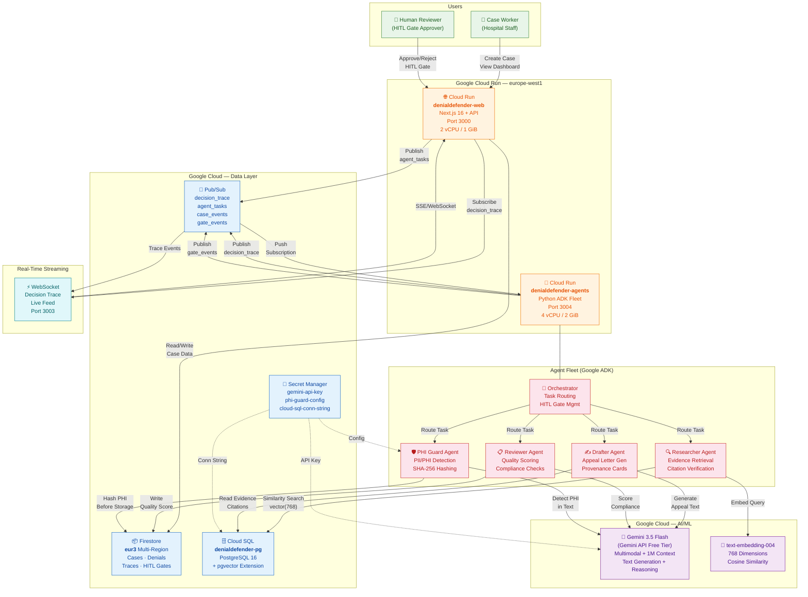
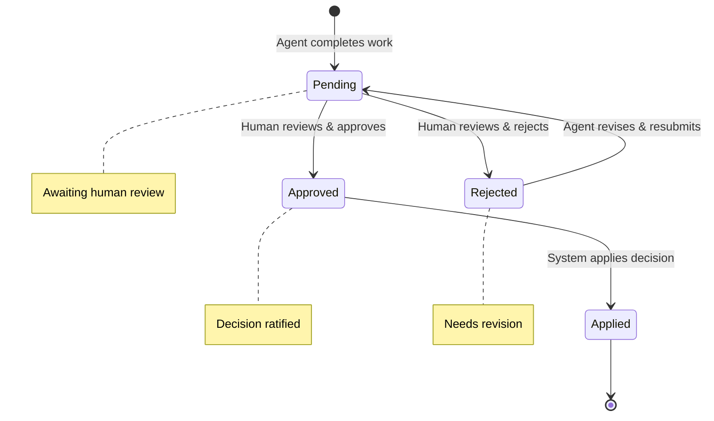
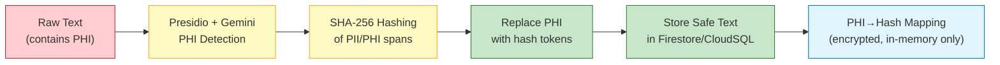
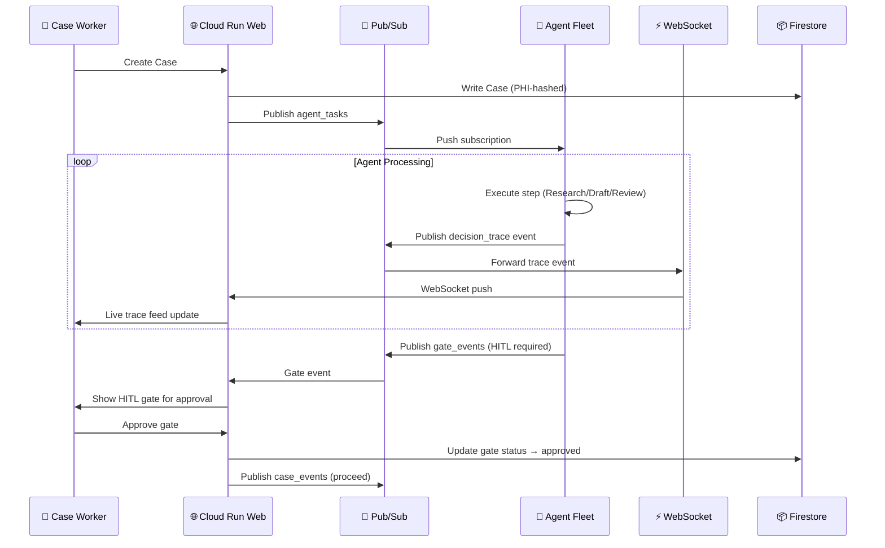

# DenialDefender — GCP Architecture Diagram

> **All Things Agentic Hackathon** — Proof of Production-Readiness
> This diagram shows the full GCP deployment architecture for DenialDefender,
> a multi-agent appeals automation system with HITL governance and PHI protection.

## System Architecture



## Component Details

### Cloud Run Services

| Service | Image | Access | CPU / Memory | Concurrency | Scale |
|---------|-------|--------|--------------|-------------|-------|
| `denialdefender-web` | `gcr.io/.../denialdefender-web:latest` | Public (unauthenticated) | 2 vCPU / 1 GiB | 80 | 0–4 |
| `denialdefender-agents` | `gcr.io/.../denialdefender-agents:latest` | Internal only | 4 vCPU / 2 GiB | 10 | 0–10 |

### Agent Fleet (Google ADK)

| Agent | Role | Gemini Model | HITL Gate |
|-------|------|--------------|-----------|
| **Orchestrator** | Routes tasks, manages workflow state | gemini-3.5-flash | N/A |
| **Researcher** | Evidence retrieval, citation verification | gemini-3.5-flash + text-embedding-004 | Before evidence use |
| **Drafter** | Appeal letter generation with provenance cards | gemini-3.5-flash | Before letter finalization |
| **Reviewer** | Quality scoring, compliance checks | gemini-3.5-flash | Before case submission |
| **PHI Guard** | PII/PHI detection and SHA-256 hashing | gemini-3.5-flash + Presidio | Before any data storage |

### Data Stores

| Store | Type | Location | Purpose |
|-------|------|----------|---------|
| **Firestore** | Document DB | eur3 (multi-region) | Cases, denials, decision traces, HITL gates |
| **Cloud SQL** | PostgreSQL 16 + pgvector | europe-west1 | Evidence embeddings (768-dim), similarity search |
| **Secret Manager** | Encrypted store | global | API keys, connection strings, PHI guard config |

### Pub/Sub Topics

| Topic | Publisher | Subscriber | Purpose |
|-------|-----------|------------|---------|
| `agent_tasks` | Web Service | Agent Fleet (push) | Dispatch agent work |
| `decision_trace` | Agent Fleet | WebSocket Service | Stream trace events to UI |
| `case_events` | Web Service | Agent Fleet | Case lifecycle events |
| `gate_events` | Agent Fleet | Web Service | HITL gate state changes |

### HITL Gates (Human-in-the-Loop)



### PHI Guard Pipeline



### Decision Trace Streaming



## GCP Project Configuration

| Property | Value |
|----------|-------|
| **Project ID** | `denialdefender` |
| **Region** | `europe-west1` |
| **Firestore Location** | `eur3` (multi-region) |
| **Service Account** | `json-775@denialdefender.iam.gserviceaccount.com` |
| **VPC Connector** | `dd-vpc-connector` (Cloud SQL access) |

## Deployment Commands

```bash
# Full deployment
bash infra/gcp/cloudrun/deploy.sh

# Web service only
bash infra/gcp/cloudrun/deploy.sh --web-only

# Agent fleet only
bash infra/gcp/cloudrun/deploy.sh --agents-only

# Apply YAML service definitions
gcloud run services replace infra/gcp/cloudrun/nextjs-service.yaml --region europe-west1
gcloud run services replace infra/gcp/cloudrun/agent-fleet-service.yaml --region europe-west1
```

## Cost Estimate (Hackathon / Free Tier)

| Resource | Tier | Monthly Cost |
|----------|------|--------------|
| Cloud Run (web) | 2 vCPU, 1GiB, 0-4 instances | ~$0 (free tier covers 2M requests) |
| Cloud Run (agents) | 4 vCPU, 2GiB, 0-10 instances | ~$0 (scale-to-zero when idle) |
| Firestore | eur3, <1GB reads/writes | ~$0 (free tier) |
| Cloud SQL | db-f1-micro, 10GB SSD | ~$7-15/mo (smallest tier) |
| Pub/Sub | 4 topics, low volume | ~$0 (free tier: 10GB/month) |
| Gemini 3.5 Flash | Gemini API Free Tier | $0 (rate-limited) — $1.50/$9 per 1M tokens (paid) |
| Secret Manager | 3 secrets | ~$0 (free tier: 6 versions) |
| **Total** | | **~$7-15/mo** |
